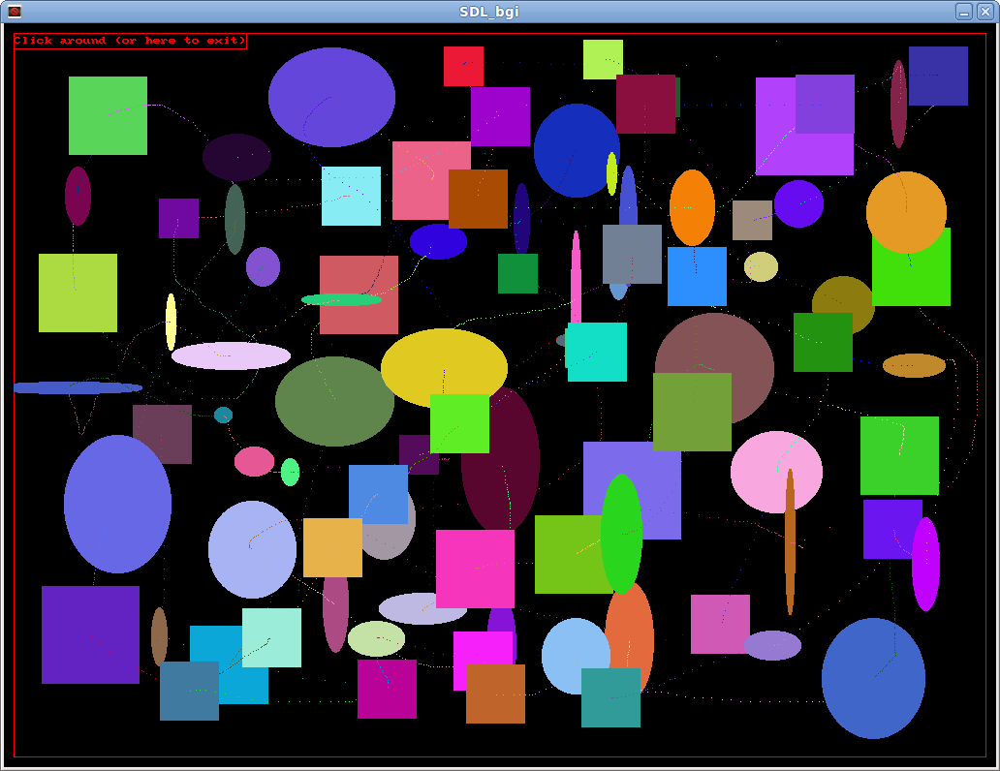
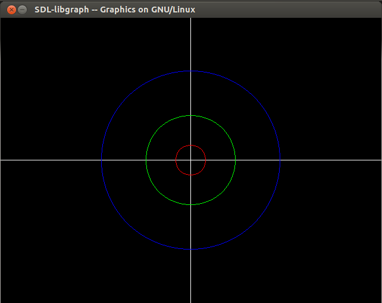

## Laz GFX- 

A UNIVERSAL replacement of the "Borland Graphics Interface" (BGI)
(For Lazarus/FPC/Pascal)

Its a GRAPHICS MODE "Canvas", not unlike TCanvas. 
You draw with it.

We will try to use "TCanvas2 objects" as the code evolves.

**Parts of SDL are being rewritten**.
SDL/SDL2 no longer suits "our Pascalian needs".
**This unit uses modified and/or patched JEDI sources** as a result.

Furthermore- 
		FreeGLUT (3D) does for 3D- what SDL does for 2D

Most notable changes/rewrites:
		SDL2 handles OpenGL2 Quads for us via "internal compositing"
				as opposed to just "pageFlipping"

		Game Precision Timers
		Threads/Threading
		Callbacks(where possible)
		"Direct" Rendering OPS/ DRI calls
		Font Code
		Unpatched JEDI x64 code sections
		Using PortAudio (uos) instead of "dodgy PulseAudio calls"

This removes a TON of headache and low-level programming.
(It helps to use the right tools.)

While the "C Syntax" is correct when utilizing SDL, the PASCAL needed some adjustment.

It makes more sense to use similar syntax, if possible.

SDL2_GFX functions have been imported into the main units. 
There was **never a need to remove these functions** from the renderer OPS in the main unit.
(There are workarounds for heap limits-Ive used them before.)

---

2D:
Windows can use:
		GDI
		GDI+
		DirectX/OpenGL 

Mac uses: 
		QuickDraw(Up to OSX 10.4 Tiger) 
		Quartz(2D) 

Unices can use: 

		Console Framebuffer/KMS

		X11
		GDK /GTK (uses Cairo accellerated rendering) on top of X11
		OpenGL(hooks X11 for input)

Because X11 is protocol based- 

	I can throw a X11 session thru your web browser
	-or across the room- 

for example. 

	Same with PulseAudio.

[X11 Basics](https://magcius.github.io/xplain/article/x-basics.html)

X11 and WinAPI use similar core routines and methods
but dont provide a "canvas" (drawable area) by themselves.

Window managers(Unices) take over the rest of what you interact with. 

(There is no assumed "core theme or X11 toolkit engine" on unices. 
The user has to choose what to install and use.)

3D:

Software-

	This is dual-buffered data rendered from the CPU. Its very slow.

OpenGL(OGL)-

	Usually Hardware assisted rendering

DirectX-

	Windows implementation of 3D rendering

Vulkan-

	Advanced 3D rendering methods using DX12+ capable hardware

---
## Ports

This unit (LazGraphics) SHOULD be ported to use the following languages:

		Ada (NASA,etc)
		Basic(FreeBasic/QB64)
		VB(gambas/MS-VB)
		python(PySDL)
		C/VC/C sharp (backport at your own peril- NO C HERE.)
		
-DONT ASK about assembler.

The reason behind this is such:

		Compiler options often out perform (even with more code) inline ASSEMBLER

Yeh-- its a weird quirk.

So if performance is lacking(usually in math areas)- 
		
		First- 
				Use better compile time optimizations
		Second-
				Use more efficient Logic methods
		Third-
				Try another method of implementation like OGL/DirectX vs WinAPI/Xlib

Ive tried to do the second for you- as best possible.

Try to keep the ports HERE- DO NOT FORK unnecessarily.
I will be happy to import code.

---		

state:  RELEASE freeze at .80 
master branch: code is unstable WIP (sorry)

-Some primitives and detectGraph missing.

Portions untested as an API:

-Fonts, SDLCore, put/getpixels tested working (with sdl v1)
-lines/rects tested (w sdl v1)
-event input and rendering mainloop tested (working with sdl v1)

(Travis CL doesnt work with Pascal sources. You wont see the nice pretty graphbar.)

---

### Why does it exist?

Some outdated BGI code needed to be brought up to speed.

You will need **this Library** if you write strictly for graphics modes or wish to.

I intend to utilize an "everything bagel" here. 

        You may not need (or want) everything on your bagel- but Im making them that way anyways.

**This code and demos are in a very early state.**
I will try to provide further demos where possible.

#### BGI 

(Borland Graphics Interface) 
"The Original Graphics library"

According to Wikipedia-

		"BGI(Borland Graphics Interface) was accessible in C/C++ with "graphics.lib" 
		and "graphics.h", and in Pascal via the "graph" unit.

		BGI is less powerful(thier opinion) than modern graphics libraries such as SDL or OpenGL, 
		since it was designed for "presentation graphics" instead of "event-based 3D applications". 

-What is not written, however, is that the codebase was abandoned because of UI environments.
When X11 and Sin came about...there was no way to use graphics mode because it was in use.
As a result you could not write an old-school graphics mode application.

Along came SDL, DirectX, and OGL....but nobody bothered to backport the BGI. 
Programming became difficult.

You can learn OGL from SDL.
OGL/DX9+ was OS limited. So what is SDL?

#### SDL 

(Simple Directmedia Layer) according to Wikipedia-
(This is mostly 2D with 3D hooks to OpenGL C routines)

		Simple DirectMedia Layer (SDL) is a cross-platform software development library 
		designed to provide a hardware abstraction layer for computer multimedia hardware components. 

		Software developers can use it to write high-performance computer games 
		and other multimedia applications that can run on many operating systems 
		such as Android, iOS, Linux, Mac OS X and Windows.

		SDL manages video, audio, input devices, CD-ROM, threads, shared object loading, networking and timers.
		For 3D graphics it can handle an OpenGL or Direct3D context.

		...

		SDL is extensively used in the industry in both large and small projects. 
		Over 700 games, 180 applications, and 120 demos have also been posted on the library website.

		A common misconception is that SDL is a game engine, but this is not true. 
		However, the library is suited to building games directly-
		 or is usable indirectly by engines built on top of it.

I have noticed numberous fail points to which SDL is NOT "simple" nor "easy" and the BGI wins in these regards. 
I do not write OOP level garbage, I find object code and repeated instantiation is a mess.
I have my own "methods" if I need object-related routines.
They work.

#### DirectX

Although primarily for windows(supported via WINE libs) this started in 2D rendering.

3D support is present in D3D library DLLs.
DLL is the windows equivalent of Linux Shared Object (so) compiler output. 
(Pre-Compiled OBJect code was the previous incarnation)

#### OpenGL

Again, according to Wikipedia-

"Open Graphics Library (OpenGL) is a cross-language, cross-platform, application programming interface (API) 
for rendering 2D and 3D vector graphics. 

The API is typically used to interact with a graphics processing unit (GPU), to achieve hardware-accelerated rendering.

[It] is used extensively in the fields of:

        computer-aided design (CAD)
        virtual reality
        scientific visualization
        information visualization (Presentation Graphics)
        flight simulation
        -and video games

"

When you see the OGL or "SDL assisted OGL" demos you will begin to understand.
I will hold your hand until we get to OpenGL.

You may also follow along here (not overly difficult once you understand SDL):

		http://wiki.lazarus.freepascal.org/OpenGL_Tutorial

QUADS refers to 2D opengl.

#### So what about Raster graphics?

Size and speed are the reasons why you use Vector graphics.
They also scale very well.

Raster graphics on the OTOH are much heaver(bigger), extremely more detailed, and do not scale well(pixelate).

Each has its own use.
Raster are smoother, as they are composed of geometric shapes, not actual per-pixel data.

So far, SDLv1 and v2 and the BGI focus on this.

So to answer you- we are working on RASTER, then working on VECTOR later(or a combination of the two).

### Pardon the mess

Everything is in one folder for a reason.
(Dont confuse *me* -or the compiler)

The .inc are mostly for SDL2 internals.
**You will need these, "DO NOT DELETE"**

You should be able to compile this once you GIT (or Download) to your computer, so long as FPC and/or
Lazarus is installed.

This code doesnt call the LCL- but yours might. 
LCL errors are up to you to fix.

SDL "Pointer issues" and mem-alloc/free issue, however, need to be worked out by you.
(If the problem doesnt come from this main unit- YOU FIX IT)

I know JEDI is broken in places and I appreciate the help in fixing it.
"JEDI" is a "C header port" to FPC for using SDL graphics.

		That means the core C routines ARE NOT PORTED.

### Why SDL and not...

There are loads of projects where people cannot post changes publicly.
Programmers are making it more difficult with mailing lists (spam) and "private repos".

(You want your code public- but team ops and comms private)

A lot of other code is half-assed or broken.
People suffer from information overload and cant figure things out
 
For the code to be useful, it must be in library format.

#### SDL is CROSS PLATFORM and UNIVERSAL CODE

You dont have to re-write routines.
If you call an SDL function- you call it the same way in other languages.

However, SDL is still very incomplete. 

The developers dont care to fix these problems.
THIS IS BAD.

Shoving people into SDL and saying "good luck"-
		
		When theres 50 ways to do things...IS WRONG.

#### FreePascal "Graphics support" is missing (or broken)

**Lazarus OGL demos DO NOT work correctly.**

Code has been abandoned.
This appears to be a shader sequence problem.

#### can we add routines??

SURE! 

But Id advise looking into the C projects already active.

This being said- DO NOT link into C versions of libgraph. 

(You will probably confuse the existing code if you do.
Further- this is why I CANT call this unit "libGraph")

You need to translate the headers(properly) to use the C.
I didnt do this because of threading problems when I used it.

These problems can be avoided if the code is written correctly.
If the code needs to be reworked- do it right.

#### Focus:

		Unices (red hat, fedora, Suse, ubuntu,debian,etc.)
        MacOSX Quartz ( at minimal X11 )
        Android(eventually- theres more to this than just getting the routines working)

Graphics libraries for DOS??

		Try the original BGI written by Borland, INC.
		The BGI has been 256 color extended - I have the patch.

There are some ports to Sin (windows) already using WinAPI. 
The WinAPI port was written to fix a SDL "speed issue".
What is not mentioned is if SDLv2 was used or SDLv1.

LibGraph(C) or otherwise-

		HAS NOT BEEN EXTENDED TO 3D.

Instead - developers want you to learn the MESS of OpenGL/DX/Quartz.

		NO. YOU DONT HAVE TO.

### Dependencies (INSTALL ME FIRST!!):

CMake
CMake-Gui
libudev-dev
mesa-dev

OSX:
		XQuartz (puts X11 back on OSX)

Unices:
		xorg-dev
		SDL2-x.x.x 		   			-- the main SDL library
		SDL2-devel-x.x.x 			-- the developer package
		SDL2_image-x.x.x 			-- image library for image support
		SDL2_image-devel-x.x.x	 	-- image library developer 
		SDL2_net-x.x.x 				-- image library for networking
		SDL2_net-devel-x.x.x	 	-- image library developer 

VR:

**STEAM uses these**

        libOpen_vr (VR helmet support)

	
These libaries are a standard part of most current distributions. 
The libaries will *probably already* (cross fingers) be installed. 

You may have to install the developer packages,however. 
Ive noticed also that "preinstalled" might point to version 1, not version 2.
Double check version 2 is installed.

#### Can I have a IDE??

Editors:

M$FT Visual Studio "Code" can be found here:

        https://code.visualstudio.com/docs/setup/

Lazarus/"FP" application/Delphi IDE
Geany

#### Crossing the line (cross-build):

	For SIN there is a WinAPI port: http://math.ubbcluj.ro/~sberinde/wingraph/main.html	
	(or you can browse the files here, which is the same thing. 
	WARNING: The colors DO NOT conform to XTerm standards, nor CGA standards-mine DO)

	The guy seems to have a better WinAPI direct access than the FPC team, therefore his unit 
	(as per 2010) AFAIK is far superior. I doubt much has changed in FPC, all of the docs still point to JEDI
	residing on sourceforge (via PGD website). It isnt there. Its on Github (and dodgy at best.)

	WinDos, WinMouse, and WinCrt units were re-written by this guy, it seems.

Cross building to Sin(windows)- also via wine:

Visual Studio "Code" Installer is enclosed, but its a "rolling release" sort of application.
Microsoft Visual Studio(classic) is over 15GB installed (YIKES!!) and unknown compatibility or syntax.

		install Visual Studio(15+GB) /VS Code editions (plus compilers) and VC depends
		You will be using native WinAPI routines (forget the rest)
		
        -OR-
		install Visual Studio(15+GB) /VS Code editions (plus compilers) and VC depends
		Go install SDL (and the source code headers) from the main site and make SURE its "version 2".

Building on Sin but using Unix/Linux(weird):

		Install Win10 Centenial edition
		Install Unix subsystem option in control panel
		install aeroTweak's link to bash
		
		right-click and "run bash here"
		do what it says to do - youll wind up inside a bash shell
		
        "sudo apt-get install build essential fpc" 
		now install the other packages mentioned above.

Mac:
		
		Mac should import the necessary units via IFDEFS. Let me know if Im off.
		(Building for Linux x64 on Ubuntu at the moment.)

	You need XCode installed
		
	Setup SDL First, then FPC. 

	For SDL in C, Try the directions here: 
			
			http://lazyfoo.net/tutorials/SDL/01_hello_SDL/mac/index.php
			(You will need XCode 6.1, "Yo-sem-i-te" is assumed.)

OS9 was removed support years ago...not sure if it has a FPC use these days.
I am looking. This is usually m68k code(arduino-ish based computers).

The IFDEFS in the Pascal code 'should' pull in everything SDL.
There is no "Lazarus" in MacOSX, you use XCode and link in the LCL routines instead.

I have a Mac available but Im working from a Linux box.
        

MOBILE:

     ModeList support is experimental (or non-existant) right now.
	(without this nothing works)

    Android (Java and Pascal to Java Porting) I need help with anyways.
    iDevices are impossible due to Apple OBJ-C proprietary licensure 
		
		(unless you want to rewrite this unit back to OBJ-C)
	
	Once you get this down and have all your secret keys-- you should have a fine day. 
	Eventually.
		

ALL ELSE FAILS: 
		
	Revert to SDL and its manuals, both off and online.
    DO NOT attempt to rewrite this main unit core routines, they are modelled after SDLv2.
    I am aware of the "Surface is really a Texture" code tweaks that have not been fully implemented yet.

    If you want v1 (surface only ops) instead, then FORK ME- and get to work!! 
    -I hear HedgeWars uses v1 if you are code inclined to wade thru the sources.
		
    Surface routines and PageFlipping are SDLv1, not v2. 
    My focus is version 2.

## Why --Pascal-- and why now and why THIS WAY?

		-Its FUN and EASY to write code for		
		-Full 16, 256, RGB, and RGBA support (32BIT) up to 1080p.

		-TCanvas for Laz doesnt quite do the job.
		-Linux has never had a graphics engine or BGI. EVER. Only TCanvas has come close(incomplete).

		-GVision for Linux (Pascal version of Win311) never took off. 
		-JEDI doesnt stand for what you think it does- its incomplete, missing, and now depreciated.
		
		-Castle engine is good, potentially "missing in places" things we should have and requires OpenGL knowhow.

		-CODE-base is non-portable. Unix uses X11/OpenGL,Mac uses Quartz and Sin uses DirectX/WinAPI.

		-This isnt a "class project", its my passion. Im not rushing my work.
		-Nobody uses Int10 DOS assembler anyore. Even less use Int10 "graphics modes".
			(Its about "context switching" between text and graphics modes)

#### Project Attempts to use or uses

	Simple DirectMedia Layer (www.libsdl.org).
	X11 "Core Drawing primitives" (www.x.org)
	WinAPI (where available and documented)
    libEVAS (https://elinux.org/Evas)
    Quartz "JAVA-API" -via XCode (https://developer.apple.com/xcode/)
		
	Modified Unit hacks provided by me

If not in use(is in use using X11 on unices):

	SVGALib
	Framebuffer "Graphics mode"

#### This project cannot use:

	VESA/Direct Video Driver access (kernel is in ring3, not ring0)	
	Assembler / INT10 or INT21 code (MS DOS specific)

### The objective of this package

	 1) to enable people to run programs written using BGI or "libGraph" functions 
         directly in "Linux"(Linus Torvaldis Unix). 
         
	 2) To take old code, help you execute it, learn form it, and move forward.

	 3) To teach you use of SDL- 
		so that you can code with or in competition to it.

#### License		 

I hope it is useful..yada yada yada....YMMV. 
**Read the Licence agreement provided**

#### Where is the application?

**This is a UNIT, not a program. See the demos provided.**

Be mindful of the initgraph (and other) header change.
Even "nil pointing" "PathToDriver" still leaves us in a window.
(If you want fullscreen--I have to ask.)

Provides(these parts should be working):

		Initgraph
		CloseGraph
		Logging
		Put/GetPixel ops
		Get/set Color ops on pixels or "screen as a whole"
		Get/Set image file to "screen"
		Alert Boxes(butt ugly SDL, not Lazarus ones which Id prefer)
		Text functions
		Lines
		Rectagles/Squares
        "Direct OpenGL" primitives support(see demo)
        SDL_Keypressed

To exit the OGL demo:

        click on the terminal that called it and press a key.

Although it calls SDL, it DOES NOT invoke event handling(which is wrong) so the output window wont accept input.
(Improper use of ReadKey() and why you shouldnt use it)

untested:

		Input handling from keyboard,mouse,joystick,haptic  (in renderloop within a unit)                
        SDL_Readkey
        SDL_Readline (should be used with dialog input, normally)

In Progress:

		Polygons
		Circles/Ellipses
		Fills(incomplete as of yet)

Non-existant:

        2d OGL Routines(QUADS, etc)
		3D OGL routines(spheres, tubes,pyramids,multi-faceted objects) -INCOMPLETE SDL testing

#### BGI output

Hold your enthusiasm. "Its pretty primitive".

### Lets run "make"....

By default the makefile compiles for :

		Win32/64
		linux 32/64 

All in one go.
FPC does NOT use MINGW libraries, like GCC requires.

To do this:

		I usually DL the FPC FULL sources and compile everything

If you have issues, ensure you are building **from a LINUX host**.

The makefile is not designed for MAC, MOBILE, nor Windows. It cross builds TO windows.

I just run FPC over the main unit file right now. Nothing fancy.

I dont know how to link this thru M$FT VS without using it- 
		it uses project files like Lazarus and Delphi.

-I havent gotten that far yet.

### DEMOS!!! LOADS OF DEMOS!!!

Demos at first will focus on BGI graphics "quality" and "basic logic".

(The othello code Ive written in the past has an excessive recursion problem)

Planned demos:

Board Games/Card Games:

	Othello, 2d chess, sorry, pente...
	Solitare, Poker, etc.
	
	
SIDESCROLLER(collision based) 2d/3d games:
    
    OpenSonic (allegro sources in C) /Mayro (SMC) remake ...
    "Super Nintendo" or "SEGA MegaDrive/Genesis" level or slightly above it. 
        
        RedBook CDROM/CDDA support is untested(as of SDLv2-unavailable).

        
3D-        
   
    OpenFreeSpace??
    OpenMorrowwind??
	OpenSkyRim?? 
    Open (world of) WarCraft??

#### COPYLEFT
  
  
This code is a "black boxed spinoff" work written primarily for FPC in Pascal.
Nothing was reverse engineered- except published documentation.

Borland, INC. has been bought out and seems to "be no more".
Unlike Microsoft, I respect thier codebase and right to copyright.

Original code for DOS (c) Borland, INC. 
Re-ported (from C) via FreePascal (FPK) dev team, myself and a few others.
I have left reference where its due in the code. 
I only accept credit where its due me.

## Final NOTE:

Code is universal language of itself. 
If I can understand German or russian programmers, you can understand my english.

There REALLY REALLY isnt much to the basics, It was one file in the original TPU from Borland.
I have extended it very much and tried to clarify very bad code and manuals and BAD C.

Learning SDL is not necessary. 
This is a BGI interface port. 

        Write for the BGI, and the code should 'just work'. (for the most part)

Seriously...the SDL syntax (in C) isnt that hard to master. 
(I can piss better C and PYTHON in my sleep-- and I refuse to write C.)

#### Have a "Final Product"??

Remember to remove debugging code and strip binaries when writing for real gaming hardware.
(Or if you are distributing your application) 

FPC Option:
 
        -Xs

option "-g" is used for debugging 

IN ADDITION to OTHER BUILD OPTIMIZATIONS like SSE/AVX.

---		
	
## Basic Q and A:

Q: I just dont get it....

A: Scan thru the headers or a PASCAL REFERENCE manual for "UNIT HEADER INVOCATION".

You should only need headers to understand Pascal syntax. 
The rest is minor details unless you want to sweat those.
Same for SDL in C. (C is backwards with variables, mind you)

Q: It seems incomplete...

A: Not quite. 
Most basic functions should work- for example: initgraph.
Keep in mind the original code was very primitive.

Im not "emulating" every function. 
Im rewriting the "most useable".

Due to SDL quirks, some functions arent (and will never be) rewritten.
Other take some "off the shelf thinking" to implement.

I will get to the more advanced functions as time allows. 

I havent really looked at the castle engine yet but one can assume that since it uses FPC,
its otherwise "feature incomplete" and they are using straight OGL.

TCanvas was half-assed.

SDL provides a bridge (to get to) OGL.
Why do it directly(PITA) when you can use "easier to use" routines?

Q: I think I found a bug!

A: Report it to me.

DO NOT SPAM. 
Ive probly discovered the issue already but havent gotten to it.
I dont want your C.

"As in foo points to variable A" is NOT pseudo-logic. Thats "C in plain english".

"foo is equal to A" 

and 

"if THIS then GO THERE"
"do while x is false"

"case X of"
"repeat ....until"

-is better.

LEARN PASCAL. 
Try to learn Lazarus. If not, try Delphi.

Q: can you port for game platform (X?)..

A: Not unless its supported by BOTH FPC and SDL.

iPhone , iPad, iWatch..have restricted OBJ-C licenses.
FPC is blacklisted. Apps are signed- and checked-for compliance- by Apple.
I cannot help you.

GO Grab a FPC RTL and get hoppin.

I cant help you here, I didnt have much luck with kernel development beyond certain points.
(This was mostly where the issue came from. )

I know how to do it, getting it to work is another matter.

You should have an "engine already made" to use if you want to go this route...
HAVOK, UNREAL, etc.

UNREAL sources are available- with a login.

Q: But this isnt useful...

A: No warrantees of...... yada yada yada...you didnt read the Licence.
Ive your not going to read, then you probably shouldnt be writing code.
Im not going to beat it into you- I have better things to do.

Q: Is this all this can accomplish?

A: Hell No.

These are baseline examples of what the BGI does and SDL certainly is far more advanced.
Ive previously written more advanced examples, potential screensavers in 256+ color modes..
etc etc.

I have to redo the BGI to get the extended support that I need- to run that code.

(The FPC code hasnt been ported in over 10 years...)
Those programs and routines were patching the BGI- as it was- already existing- for DOS.
I didnt write assembler, so the code *is* portable.

You need the baseline to establish "graphics mode" before you can add more functionality.
This is Mostly "backwards compatible" but Im not Borland and Im doing it my way.

You will probably be using alpha blending,blittering and rendering or mixed of those
and Anti-Aliased stuff I havent written for yet. 

Not a problem -but Im not there yet. 

Q: Whut? 3D? Physics? huh? The files says 'physics'...

A: Unlike the BGI, SDL uses both 2d AND 3D/OpenGL functions. 
So YES, we can and we WILL extend our code.

POSTAL uses SDL.
POSTAL2 uses Unreal engine
Skyrim uses Havok/DX9

There are two types of physics:

		Render Target (SDL engine and sprite collision)
		Physics (Math based w 3d objects)

Render Target comes first(2d). 
For the latter "think nVidia".

If you can get **HERE**  advanced game design should be a cakewalk for you.
And **THAT** is the point.

Q: Runtime errors..I get these STUPID ERRORS!

A: 

This is WIP- expect the occasional build bug. 
I might be break-fixing something.
(Thats life.)

Furthermore- 

        Check for a RELEASED UNIT. 

Check SDL depends for multimedia. 
(I cant control those..SDL links into them as seperate projects.)

Error 2 is File not Found
Error 216 is usually an "out of bounds" caused by "Alloc and not Free" POINTER errors

AKA:

		You are doing something in a loop that continuously allocates (surface) ram but doesnt free it.
		-or some pointer was dereferenced (emptied) twice.

Could be also that you need to recompile Lazarus(point variance I call it-version mismatch) or build some
or all of the LCL subcomponents. THAT- I CANT help you with.

LibVLC expansion is planned but I will have to check the sources for viability.
LibFFmpeg is also available.

Q: No comprende? 

A: Libtool. (Problema.)	

There exist a way with Qt apps to do MOC (.po) or something. 
FPC has the "feature" but I dont know how to use it.

It has to do with aclocal and locales.

