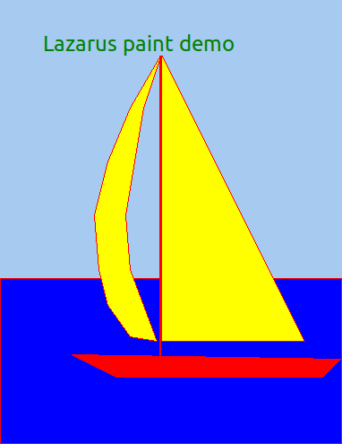
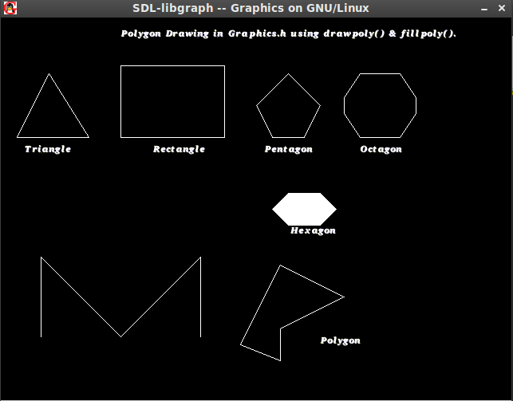
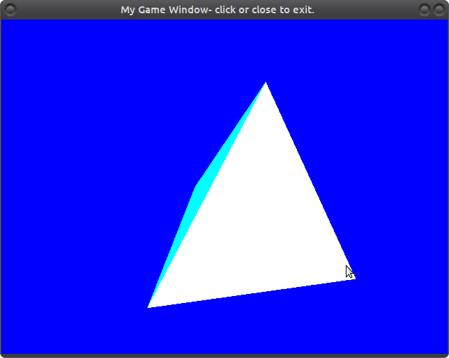

## Laz GFX- 

A UNIVERSAL replacement of the "Borland Graphics Interface" (BGI)
(For Lazarus/FPC/Pascal)

Its a GRAPHICS MODE "Canvas", not unlike TCanvas. 

-You draw with it. 
2D and 3D modes are supported.

Scene Rendering support is limited. 
Try "Castle Engine".

TL;DR?? 
TOO BAD. 
READ. 
I WILL HOLD YOU TO THIS TEXT.

### LEGAL-ese

Since I am starting to see changes in NASA/JPL and other demos out in the wild-
**LEGAL DEFINITIONS and MUMBO-JUMBO MUST BE ADHERED TO**.

Licensed under Apache License, Version 2.0.
This statement applies to all code enclosed herein:

        Unless required by applicable law or agreed to in writing, software
        distributed under the License is distributed on an "AS IS" BASIS,
        WITHOUT WARRANTIES OR CONDITIONS OF ANY KIND, either express or implied.

        See the License FILE for the specific language governing permissions AND
        LIMITATIONS under the License.

### Render-Targets

Default 2D target is OpenGL via freeGLUT

MAY also use as a fallback(slow):

        Framebuffer(No X11)
        Dos (libPTC)
        WinAPI (needs a rewrite)
        libX11 (primitives)

Default 3D target is OpenGL via freeGLUT

### EXTERNAL LIBS warning:

This UNIT API uses several external libs-

		THIS IS HOW LINUX IS DESIGNED
		
The location of which on Windows is completely unknown.
(they could be anywhere-even missing-)

### Why is SDL here?

SDL 1 and 2  "unified sources" included- for your pleasure programming.

SDL2_AUDIO is encountering a random Pointer bug after failing somewhere .
(Im assuming it cant find the soundcard device. PortAudio/uos doesnt seem to have that problem.)

I have found that SDL is scattered to the winds, and that developing for it -is hard- because of that.
But its good code to get started with.
It will give you a basic idea what - and how- things work.

OpenGL and SDL (in 3d) dont mix very well.

You dont need SDL for input. 
freeGLUT/OGL gives it to you.

### Portage status

WIN32:

		Win32 port is coming.
		WinAPI port is lacking in the way X11 is dodgy...hmmmmmm

MAC:

		My Mac mini has XCode- and I have a VM (or three).
        Im looking to the needed libs right now.

Ubuntu:

		has a serious FPC/Lazarus distribution flaw. 

		DO NOT INSTALL FPC or Lazarus from the OS repository!!!!
		(You have three "bleeding edge" svn packages to install instead.)

Castle /sceneGraph engine will install just fine.

## Ports

This unit (LazGraphics) SHOULD be ported to use the following languages:

		Basic(FreeBasic(FBC)/QB64)
		VB(gambas/VB.Net)
		C/VC/C sharp (backport at your own peril- NO C HERE.)
		ADA
		
-Hooks are present w freeGLUT/GL- 

		Ada 
		FORTRAN 
		python (pyGL/pg)
		Gambas(via SDL-and GL libs)
		
-DONT ASK about assembler. The compiler does this for you.
Assembler -in flight- does not guarantee optimized code.

So if performance is lacking(usually in math areas)- 
		
		First- 
				Use better compile time optimizations
		Second-
				Use more efficient Logic methods
		Third-
				Try another method of implementation like OGL/DirectX vs WinAPI/Xlib

Ive tried to do the second for you- as best possible.
Math is not my strong-suit.(GL is riddled w Matrice Math)

Try to keep the ports HERE- DO NOT FORK unnecessarily.
I will be happy to import code.

---

### Build status:

(Travis CL doesnt work with Pascal sources. You wont see the nice pretty graphbar.)

state:  RELEASE freeze at .80 (SUCCESS)
master branch: code is unstable WIP. May or may not build.

I have a SHITTON of rewrites with the "OGL switch" pending.
(This may take some time to get something that compiles.)

to Fake: detectGraph()
(resolutions used are too low)

---

### Why does this project exist?

Some outdated code needed to be brought up to speed.

You will need **this Library** if you write strictly for graphics modes or wish to.

I will try to provide further demos where possible.

### Technobabble

#### BGI 

(Borland Graphics Interface) 
"The Original Graphics library"

According to Wikipedia-

		"BGI(Borland Graphics Interface) was accessible in C/C++ with "graphics.lib" 
		and "graphics.h", and in Pascal via the "graph" unit.

		BGI is less powerful(thier opinion) than modern graphics libraries such as SDL or OpenGL, 
		since it was designed for "presentation graphics" instead of "event-based 3D applications". 

-What is not written, however, is that the codebase was abandoned because of UI environments.
When X11 and Sin came about...there was no way to use graphics mode because it was in use.
As a result you could not write an old-school graphics mode application.

Along came SDL, DirectX, and OGL....but nobody bothered to backport the BGI. 
Programming became difficult.

You can learn OGL from SDL.
OGL/DX9+ was OS limited. So what is SDL?

#### SDL 

(Simple Directmedia Layer) according to Wikipedia-
(This is mostly 2D with 3D hooks to OpenGL C routines)

		Simple DirectMedia Layer (SDL) is a cross-platform software development library 
		designed to provide a hardware abstraction layer for computer multimedia hardware components. 

		Software developers can use it to write high-performance computer games 
		and other multimedia applications that can run on many operating systems 
		such as Android, iOS, Linux, Mac OS X and Windows.

		SDL manages video, audio, input devices, CD-ROM, threads, shared object loading, networking and timers.
		For 3D graphics it can handle an OpenGL or Direct3D context.

		...

		SDL is extensively used in the industry in both large and small projects. 
		Over 700 games, 180 applications, and 120 demos have also been posted on the library website.

		A common misconception is that SDL is a game engine, but this is not true. 
		However, the library is suited to building games directly- 
            or is usable indirectly by engines built on top of it.

I have noticed numberous fail points to which SDL is NOT "simple" nor "easy" and the BGI wins in these regards. 
I do not write OOP level garbage, I find object code and repeated instantiation is a mess.
I have my own "methods" if I need object-related routines.
They work.

#### DirectX

Although primarily for windows(supported via WINE libs) this started in 2D rendering.

3D support is present in D3D library DLLs.
DLL is the windows equivalent of Linux Shared Object (so) compiler output. 
(Pre-Compiled OBJect code was the previous incarnation)

#### OpenGL

Again, according to Wikipedia-

"Open Graphics Library (OpenGL) is a cross-language, cross-platform, application programming interface (API) 
for rendering 2D and 3D vector graphics. 

The API is typically used to interact with a graphics processing unit (GPU), to achieve hardware-accelerated rendering.

[It] is used extensively in the fields of:

        computer-aided design (CAD)
        virtual reality
        scientific visualization
        information visualization (Presentation Graphics)
        flight simulation
        -and video games

"

QUADS refers to "2D opengl". Squares have four points.
The co ordinate system- by default is FUBAR, IMHO. Ive patched it "back to sanity".

Refernece Materiels coming (OGL Red/Blue/Green/Orange books)

SDL GFX unit is no longer needed(at all). 
Dont freak out- we have similar implementation.

Major missing chunks of "the BGI" are coming together, quickly.

### So what about Raster graphics?

Size and speed are the reasons why you use Vector graphics.
They also scale very well.

Raster graphics on the OTOH are much heaver(bigger), extremely more detailed, and do not scale well(pixelate).

Each has its own use.
Raster are smoother, as they are composed of geometric shapes, not actual per-pixel data.

So far, SDLv1 and v2 and the BGI focus on this.

So to answer you- we are working on RASTER, then working on VECTOR later(or a combination of the two).

### Pardon the mess

Everything is in one folder for a reason.
(Dont confuse *me* -or the compiler)
Im working on cleaning this up. (-Fu option - no thats the compiler option, not a joke.)

You should be able to compile this once you GIT (or Download) sources to your computer, so long as FPC and/or
Lazarus is installed.

This code doesnt call the LCL- but yours might. 
LCL errors are up to you to fix.

OGL/SDL "Pointer issues" and mem-alloc/free issues- need to be worked out by you.
Im having a hard time debugging them myself- and SDL doesnt want to co operate.

## Why WHYE ..WHY..

Why freePascal?

		-Full 16, 256, RGB, and RGBA support (256BPP?) up thru 1080p.

		-TCanvas for Laz doesnt quite do the job.
		-Lazarus jumps from TCanvas(half-assed) to OpenSceneGraph and busted GL.
		
		-GVision for Linux (Pascal version of Win311) never took off. 
		-JEDI doesnt stand for what you think it does- its incomplete, missing, and now depreciated.
		-Because Delphi is windows only (and non portable)
		
		-Castle engine is good, BUT requires OpenGL (and Lazarus) knowhow.
			(You probly dont- know- the how)
			
		-Lazarus is turning into OOP OBJ customized UnFreePascal, much like VC did.
				Code is either for FPC -- or its not.
			
		-This isnt a "class project", its my passion. Im not rushing my work.
		-Nobody uses Int10 DOS assembler anyore. 
		-This is 32/64 bits code. I dont write "8bit hacks".

        -FreePascal "Graphics support" is missing (or broken)
        -Lazarus OGL demos DO NOT work (correctly).

        -Code has been abandoned. 
        -Code that used to work- suddenly isnt working.

(This appears to be a "shader sequence" or Perspective problem.)

There are loads of projects where people cannot revise changes publicly.
Programmers are making it more difficult with mailing lists (spam) and "private repos".

        This isnt the 1990s. 
        USE GITHUB. 
        USE TRAC(or similar). 
        COLABORATE.

A lot of other code is half-assed or broken.
People suffer from information overload and cant figure things out.
 
For the code to be useful, it must be in library format.
SDL doesnt do enough- however- it points us to a common codebase and UNIVERsalITY.

If you call an SDL function- you call it the same way 

		in other languages
		on other platforms or OSes

The developers dont care to fix problems.
        
        THIS IS BAD.

Shoving people into SDL and saying "good luck"-
		
		When theres 50 ways to do things...IS WRONG.

Need Graphics libraries for DOS/FreeDOS??

		Try the original BGI written by Borland, INC.
		The BGI has been 256 color extended - I have the patch.
        HDMIx (and SDL) MAY work- and then again, so might PTC unit.

### Dependencies (INSTALL ME FIRST!!):

WYE WHY WHY....(quiet)..

NO-

		Im not going to make a slimmed down API using only internal routines.
		If you want to- thats on you. Linux is not designed this way.

		1- im not that much of a genious
		2- linux programming has 50 ways of doing things -and none- are correct
		3- I dont know that many Linux internals(but I know enough)
		4- I would be 350 years old before finishing(even core routines)

You need development packages installed as well as the libraries themselves

libUOS is on GitHub- look for it. WE WILL BE USING IT.
I tried to include it.

**You dont need SDL nor its sources if you dont plan on using it.**

Unices:

		libudev (USB device support)
		mesa (OpenGL base)
		libSOIL (DirectDrawSurface texture loading,etc)
		xserver-xorg (X11 itself)
		xserver-xorg-drivers-VENDOR (your vendors X11 dirver)
		SDL2-x.x.x 		   			-- (SDL)
		SDL2_image-x.x.x 			-- (SDL image support)

		libPortAudio	(required backend)
		libsndfile (audio conversion)
		libMpg123  (audio conversion -mp3)
		libMp4  (audio conversion - mp4a)
		libFaad  (audio conversion -faad)
        libOpen_vr (VR helmet support)
        Pascal INet and/or Indy libs(Net support)

OSX:

Install XCode
You need X11 from here

			https://www.xquartz.org/

For SDL in C, Try the directions here: 
			
			http://lazyfoo.net/tutorials/SDL/01_hello_SDL/mac/index.php
			(You will need XCode 6.1, "Yo-sem-i-te" is assumed.)

We need to setup FPC and the LCL now. This is a process.

Sin(windows):

        Install Freepascal/Lazarus and build the main unit on the command-line.

For C apps/OGL demos:

        Setup is similar to OSX

        Install MSVC
        Move the files somewhere nice. 

I will have a project file (or two) for you,soon.

#### Can I have a IDE??

IDE wich understand Pascal syntax:

Lazarus(DUH)
FPC "FP" application(just type 'fp' on the command line)
M$FT Visual Studio "Code"

		https://code.visualstudio.com/docs/setup/

Text Editors:

		Delphi IDE
		Geany
		XCode (once fpc is installed into it)

#### Crossing the line (cross-build):

Building for Windows from Linux:

This can be done with minimal fuss from the Makefile
(Test with WINE API or a VM)

Buildig on windows(no linux either way involved):

	You need Visual Studio (Classic) -not "code"- to build (MSVC) applications.
	(The installation is over 15GB)
	https://visualstudio.microsoft.com/vs/features/cplusplus/

	(I dont know about the Linux-connect instead of using API thing just yet)

	For SIN there is a WinAPI SDL (version): http://math.ubbcluj.ro/~sberinde/wingraph/main.html	

	WARNING: The colors DO NOT conform to XTerm standards, nor CGA standards-mine DO)
	WinDos, WinMouse, and WinCrt units were re-written by this guy, it seems.

	It sucks- its ancient, 3D is dodgy- but it builds.

Building on windows (cli) but using Unix/Linux subsystem:

		Install Win10 Centenial edition
		Install Unix subsystem option in control panel
		install aeroTweak's "link to bash here"
		
		right-click and "run bash here"
		do what it says to do - youll wind up inside a bash shell
		
        "sudo apt-get install build essential fpc" 
		now install the other packages mentioned above.

		NOTE: X11 applications do not run this way.
	
		Visual studio(above) will work with this- but I dont see the documentaion on MSFT website.

Mac:
		
		Mac should import the necessary units via IFDEFS. Let me know if Im off.
		(Im Building for Linux x64 on Ubuntu at the moment.)

MOBILE:

    ModeList support is experimental (or non-existant) right now.
	(without this nothing works)

	Color depth is faked- its not 32bit color and 1080p on your damn phone.

		NOR WILL IT EVER BE.
		(Usually 3:3:2 or something like that.)
		
    Android (Java/ "Pascal to Java Porting") I need help with. I have Android Studio installed.

    iDevices are impossible due to Apple OBJ-C proprietary licensure 
		
		(unless you want to rewrite this unit back to OBJ-C)
	
	Once you get this down and have all your secret keys-- you should have a fine day. 
	Eventually.
	ALL MOBILE CODE IS SIGNED.

ALL ELSE FAILS: 
		
	Revert to  manuals, both off and online.
    DO NOT attempt to rewrite this main unit core routines UNLESS YOU KNOW WHAT YOU ARE DOING.
    I am aware of the "Surface is really a Texture" code tweaks that have not been fully implemented yet.

### The objective of this package

        1) to enable people to run programs written using BGI or "libGraph" functions 
        directly in "Linux"(Linus Torvaldis Unix). 
        
        a)	To simplify GAME DEVELOPMENT and OS MULTIMEDIA programming
         
        2) To take old code, help you execute it, learn form it, and move forward.

        3) To teach you - 
		so that you can code with or in competition to- my code.

#### Where is the application?

**THERE WILL NEVER BE ONE**
**This is a UNIT, not a program. See the demos provided.**

Be mindful of the initgraph (and other) header change.
Even "nil pointing" "PathToDriver" still leaves us in a window.
(If you want fullscreen--I have to ask.)

The pyramid(tetrahedron) demo has been SDL v2 patched and now utilizes event based input alongside OGL.

		There is no text (OutText) functions in OGL right now.
		(those are -not currently implemented- freeGLUT functions)

SDL OutText routines DO NOT WORK with OGL/freeGLUT. THEY MUST BE REWRITTEN.

#### Library DEMO output

### Lets run "make"....

	MSVS requires a .sln file
	Lazarus uses .lpi file
	XCode wants a .project file
	
I just run FPC over the main unit file right now. Nothing fancy.
The makefile will be used in the future. (Bash doesnt like it.)

### DEMOS!!! LOADS OF DEMOS!!!

Demos at first will focus on BGI graphics "quality" and "basic logic".

(The othello code Ive written in the past has an excessive recursion problem)

Planned demos:

Board Games/Card Games:

	Othello, 2d chess, sorry, pente...
	Solitare, Poker, etc.
	
Due to sceneGraph and complexity of OpenGL code- I am stopping here.
The main reason is this-

		Shaders!! You stop editing output on-the-fly and start buffering pre-canned shaders!
		(by the millions)

SideScrollers could be done-

        You can have fun. A few have been done (Maryo World/HedgeWars) in SDL.

3D titles like OGRE/Morrowind+ need extreme set of OGL/OCL skills.
(I am not prepared to go there.)

The C is incredibly complex and difficult to read- let alone port.

Some of this portage is coming from PGD- its already in Pascal.
        
        Im just fixing the breakage.	

## Final NOTE:

Code is universal language of itself. 
If I can understand German or russian programmers, you can understand my english.

There REALLY REALLY isnt much to the basics, It was one file in the original TPU from Borland.
I have extended it very much and tried to clarify very bad code and manuals and BAD C.

        including several "BS-level students HOMEWORK" 

This is a BGI interface port. 

        Write for the BGI, and the code should 'just work'. (for the most part)

Seriously...the SDL (and sometime openGL) syntax (in C) isnt that hard to master. 
(I can piss better C and PYTHON in my sleep-- and I refuse to write C.)

#### Have a "Final Product"??

Remember to "remove debugging code and strip binaries".

---		
	
## Basic Q and A:

(Please dont complain or file bugs on these basis)

Q: I just dont get it....

A: Scan thru the headers or a PASCAL REFERENCE manual for "UNIT HEADER INVOCATION".

You should only need headers to understand Pascal syntax. 
The rest is minor details unless you want to sweat those.
Same for SDL in C. (C is backwards with variables, mind you)

Q: I think I found a bug!

A: Report it to me.

DO NOT SPAM. 
Ive probly discovered the issue already but havent gotten to it.
I dont want your C.

"As in foo points to variable A" is NOT pseudo-logic. Thats "C in plain english".

"foo is equal to A" 

and 

"if THIS then GO THERE"
"do while x is false"

"case X of"
"repeat ....until"

-is better.

LEARN PASCAL. 
Try to learn Lazarus. If not, try Delphi.

Q: can you port for game platform (X?)..

A: Not unless its supported by BOTH FPC and OpenGL.

		iPhone , iPad, iWatch..have restricted OBJ-C licenses.
		FPC is blacklisted for these targets. 
		
		Apps are signed- and checked-for compliance- by Apple.
		I cannot help you.

GO Grab a FPC RTL and get hoppin.

I cant help you here, I didnt have much luck with kernel development beyond certain points.
(This was mostly where the issue came from. )

I know how to do it, getting it to work is another matter.

You should have an "engine already made" to use if you want to go this route...
HAVOK, UNREAL, GEARS of WAR, etc.

UNREAL sources are available- with a login.

Q: But this isnt useful...

A: No warrantees of...... yada yada yada...**you didnt read the Licence**.
Ive your not going to read, then you probably shouldnt be writing code.
Im not going to beat it into you- I have better things to do.

		LIKE WRITE CODE!

Q: Is this all this can accomplish?
A: Hell No.

I leave most excersies up to the reader- as THIS IS A LIBRARY.

Q: Runtime errors..I get these STUPID ERRORS!

A: 

This is WIP- expect the occasional build bug. 
I might be break-fixing something.
(Thats life.)

Furthermore- 

        Check for a RELEASED UNIT. 

Check SDL depends for multimedia. 
(I cant control those..SDL links into them as seperate projects.)

Could be also that you need to recompile Lazarus(point variance I call it-version mismatch) or build some
or all of the LCL subcomponents. THAT- I CANT help you with.

        -OR HELP ME WRITE CODE.

Q: No comprende? 

A: Libtool. (Problema.)	

There exist a way with Qt apps to do MOC (.po) or something. 
FPC has the "feature" but I dont know how to use it.

It has to do with aclocal and locales.

